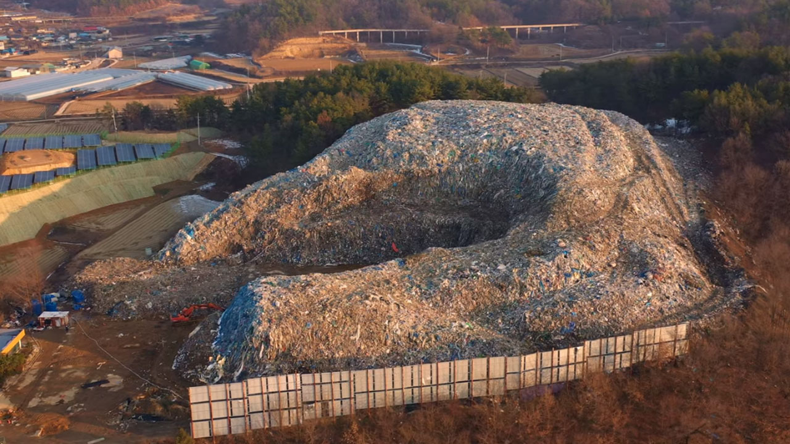

# 기획 회의

- 23-09-22

## 메인시스템

단순 2D, 3D가 아닌 장르의 변화를 주고자 함

텍스트 알피지 -> 비쥬얼 노벨 -> 언더테일(2D 사이드 뷰)

## 게임이 주고자 하는 분위기

- 블랙앤 화이트 컬러 이질적인 다른 게임 요소의 디자인
- 메인 시스템 레퍼런스: 주먹왕 랄프, 언더테일, 에보랜드

블랙앤 화이트는 등장인물, 배경, 오브젝트만 가져가고

UI는 그 게임 성격에 맞게

## 게임 엔딩, 목표

- 멀티 엔딩희망

## 지금 당장 정해야 하는 것

### 마을 분위기 -> (사운드, 아트 작업)

### 게임 아트 레퍼런스

산에 둘러싸인 마을에서 게임 팩을 줍고 있는 주민 디자인

### 게임 사운드 레퍼런스

스타일로폰사운드

기계적인

https://www.youtube.com/watch?v=4ujd5pti0ZI