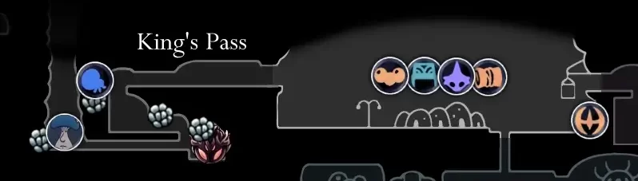

# 브릿지 23-2 프로젝트 제안

## 기획서

- 타이틀(제목, 이름)
  - 게임의 무덤?
  - 10기 프로그래머 이정안
- 팀장소개 (경험, 성향, 팀장이 된 이유 -> 실제 회사에서 하는 애자일 스크럼, 제대로 출시까지 가고 싶어서)
  - 장기 프로젝트 (6개월 이상) 4개
  - 사이드 프로젝트 4개 이상
  - 일상은 P, 작업은 J
  - 처음 만드는 게임 10개는 똥이라는 말, 이번에는 제대로된 개발 프로세스, 방법론을 도입해서 제대로 출시까지 갈 자신이 있음

### 기획의도

어떤 게임인지 앞서서 기획의도

- 요즘에 유행하는 인디게임들 특징을 살리고, 과거의 잊혀진 추억의 게임들
- 저격한 포인트는 공감성, 병맛, 숨겨진 스토리 등등
- 반복도 좋지만 적은 코스트로 다양한 경험을 주고 싶어서
  
(키워드 는 둥둥)

- 키워드
  - 공감, 블랙앤 화이트, 이미테이션, 

### 게임설명

- 게임 시스템 (핵심, 서브)
- 게임 플레이 flow

- 텍스트 콘솔, 2D, 3D, 비쥬얼 노벨
- 다크 판타지, 퍼즐

#### 게임 스토리



잊혀진 게임들이 있는 마을인 `퀘렌시아`에 접속한 플레이어 게임을 플레이하며 마을의 비밀을 파헤친다.

처음 접속하니 콘솔창에서 Text로 플레이를 하며 XX게임에서 튀어나온 용을 물리쳐야 한다.

처음에는 깰 수 없는 구조로 만들어져서 죽음을 반복하여 캐릭터를 새로 만들고 플레이하게 된다.

마을의 고물상이 파는 아이템을 사서 플레이하며 마을의 비밀을 파헤쳐라!

고물상은 아이템을 파는데 아이템이 다른 잊혀진 이미테이션 게임들의 설정창(리듬 게임), 인벤토리(RPG), 스탯창(비쥬얼 노벨) 등등을 판매하는 

```대본
되게 웃기게 스탯창을 안팔아서 비쥬얼노벨 스탯창을 구매해서 매력을 올리던가

게임의 상식에서 벗어난 다양한 `N`스러운 아이디어가 되게 많다.

사운드 팩도 상점에서 구매하여 적용해야 열리는 기믹이 있다던가 정말 다양하게 가지를 뻗을 수 있음
```

해금 조건은 마을 주민들의 퀘스트를 수행하여 얻을 수 있다 -> 어떤 미니게임의 아이템을 얻어오는 것

#### 메인 시스템

게임 자체가 한 마을에서 이뤄지고 마을 자체를 변경해가면서 플레이 해야함

- 콘솔 텍스트, 2D, 3D등 다양한 플랫폼을 옮겨다녀야 하는데 이는 메인 스트림을 통해 진행됨

ex) 상점에서 구매한 설정창 아이템에서 2D -> 3D로 변경하여 플레이 자체의 환경을 변환

: 한 마을에 대한 지루한 느낌보다 색다른 느낌으로 플레이 가능

메인 스트림을 진행하기 위해서 서브 시스템을 클리어하여 조건을 충족하여야 함

#### 서브 시스템

마을 주민들의 부탁으로 잊혀진 게임들(병맛)을 플레이하여 필요한 아이템을 수급

ex) `빨간 모자를 쓴 남성의 콧수염`같은

이런 퀘스트를 클리어 하면서 게임의 숨겨진 의미, 스토리를 자연스럽게 노출

게임은 팩맨이라고 한다면 팩맨의 유령으로 플레이하는 씩의 병맛적인 요소, 무너지는 테트리스 등등

숨겨진 업자 이미테이션게임을 만드는?

### 게임 아트, 레퍼런스

- 게임 아트 스타일
  - 기본적으로 블랙 앤 화이트
  - 포인트되는 부분은 색상을 넣어서 이질감을 줌(텍스트 알피지인데 설정창은 고퀄게임의 설정창 등등)
  - 전체적으로 실제 연극같은 아트풍(돈 스타브, 램오브 컬트 등등)
- 언더테일, 스톤알피지, 드래곤 퀘스트
- 그 외 매우 다양한 이미테이션 게임

- 개인적으로 담고싶은 스토리
  - 죽음과 삶
  - 이상과 현실
  - 아나키스트의 마을 (왕이 없는 마을)

BUT 게임에 스토리를 담고 싶으면(하고 싶은 말을 하고 싶다면) 게임이 기본적으로 재밌어야 한다.

블랙앤 화이트라 개발 비용이 적음

### 개발 방식

```대본
스케일이 크다고 생각할 수 있는데 게임 설계 자체가 구조적으로 독립된 형태라 되게 간단함

다양한 게임에 대해 찍먹으로 제작한다는 느낌으로 여러 경험을 할 수 있음

-> 이미 유명한 게임들의 이미테이션이라 정보도 많음
```

실제 현업에서 사용하는 애자일 스크럼 방식을 도입하여 개발

*도입하여 팀에 맞게 변화하여 적용*

- 현업 개발 PM분의 멘토링을 받을 예정 (격주 단위로)
  - 프로젝트를 성공시키는 법에 대한 이야기
  - 효과적인 개발적인 개발 방법에 대한 이야기

단순 포폴이 아닌 실제 출시를 목적으로 설계를 하고 기획

```대본
- **계획적으로 하는 걸 해봤는지**
  - 보통은 없다
  - (이 프로젝트가 계획적으로 진행된다는 걸 설명하기)
  - 디테일한 작업 계획은 개인이 가져가야함, 큰틀은 목록으로 뽑는다.

- 진행상황 공유
  - 자신의 능력치를 제대로 인지하는지
  - 매일 매일 진행상황을 공유하는 것에 대한 생각

- 꾸준한 프로젝트를 지향한다
  - CI/CD, 프로젝트 목표, 회고를 명확하게 할 것을 사전에 고지
  - 다같이 확인해야함
    - 이게 되어야 예측이 가능함

**애자일의 스크럼 방식 -> 스프린트 방식**

설계하고 실행하고 회고한다.
```

### 모집

- 기획 : 1명
- 프로그래밍 : 1명
- 아트 : 2명

강조하고 싶은 것

비슷하고 별 다른 100개의 게임보다 제대로 된 1개의 게임을 만들고 싶다면 참여

잘 만들 자신이 있다.

### 목표

1년 이상을 생각, 스튜디오 개설까지

- 중간 중간 목표 설정
  - 내년 SGM, GDC, E3 등등 무조건 지원

- 중간 중간 워크숍은 열리는 게임잼을 같이 나가면 좋을 듯 하다.

### 문의 창구

- 인터뷰 예정, 카카오톡 알려주기